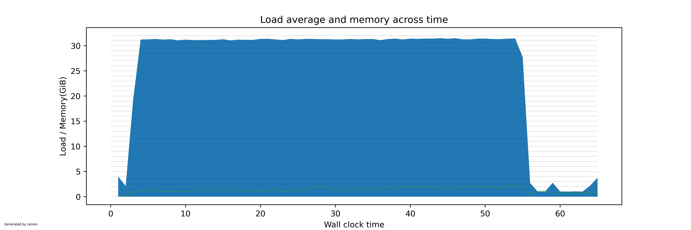

[](https://github.com/mtzguido/ramon/actions/workflows/ci.yml)
# ramon

****R***esource ***a***ccounting and ***mon***itoring*

This tiny tool creates a cgroup for your command and prints resource
usage information simply by reading the cgroup's counters. This makes
the measurement also cover any process spawned by your invocation
(unless they happen to switch cgroups). Multiple threads of a same
process are also accounted for.

ramon is meant to be **fast**. I estimate the overhead of monitoring
below 0.01%, as long as the monitored process are actually doing work.

This makes it incredibly easy to measure the resource consumption of,
say, a `make` invocation. See this invocation when compiling the Linux
kernel on a 16-core 32-thread machine:
```
$ make defconfig
...
$ ramon make -j32
ramon: cwd                  /home/guido/src/linux
ramon: start                Tue Dec  5 23:35:19 2023
ramon: nproc                32
ramon: sys.mem              63433 MiB
ramon: sys.mem.free         47187 MiB
ramon: sys.mem.avail        63070 MiB
ramon: sys.nprocs           1495
ramon: argv                 0 = make
ramon: argv                 1 = -j32
ramon: childpid             3817479
  GEN     arch/x86/include/generated/asm/orc_hash.h
  WRAP    arch/x86/include/generated/uapi/asm/bpf_perf_event.h
  WRAP    arch/x86/include/generated/uapi/asm/errno.h
...
  CC      kernel/signal.o
  CC      net/ipv6/exthdrs_offload.o
ramon: poll                 wall=30.999s usage=898.278s user=767.628s sys=130.650s mem=2017734656 roottime=0.000s load=31.28 rootload=0.00
  AR      drivers/tty/hvc/built-in.a
  CC      net/ipv6/inet6_hashtables.o
...
  OBJCOPY arch/x86/boot/setup.bin
  BUILD   arch/x86/boot/bzImage
Kernel: arch/x86/boot/bzImage is ready  (#1)
ramon: end                  Tue Dec  5 23:36:25 2023
ramon: root.execname        make
ramon: root.utime           0.000s
ramon: root.stime           0.000s
ramon: group.total          1666.818s
ramon: group.utime          1422.595s
ramon: group.stime          244.223s
ramon: group.mempeak        2729MiB
ramon: group.pidpeak        176
ramon: status               exited
ramon: exitcode             0
ramon: walltime             65.966s
ramon: loadavg              25.27
```

As seen above, ramon will show a summary at the end with elapsed wall
clock time, total CPU usage (accounting for multiprocessors), system
time used, peak memory usage, peak PID count of the group.

Ramon will also output the load average during the call, a rough
measurement of the parallelism that was exhibited overall. It is simply
computed as `(total CPU time) / (wall time)`. In this case, a factor
of 25 for 32 processors shows decent parallelism, but perhaps less than
what you would expect! This is Amdahl's law in play, see below for more.

Also, every second, ramon will poll the group and print a line marked
with `poll`. The poll will show the times consumed thus far, the current
memory usage, and the current instantaneous load of the group, which
makes it trivial to see when your build is actually being parallel. Above
we see a load of 31.28, which is close to maximum utilization for the 32-thread
machine. The `rootload` field shows the CPU usage of the *root* process of the
group, in this case `make`, which does not do much work at all itself.

## Plots

You can save the measurements performed by ramon with the `-o` or
`--tee` options. If you had polling enabled, this file can be used to
quickly generate a plot or the CPU and memory usage of the run.
```
$ ramon --tee linux.ramon make -j32
...
$ ramon-render.py linux.ramon
Saved image in linux.ramon.png
```
And this is the result:



## Hierarchical invocations

## Marks

## Misc

- You can trigger a poll by sending a SIGALRM to ramon.

## TODO
- Sort out cgroups1 vs cgroups2, can we support both?
- make hierarchical: find current cgroup and nest within itA
- handle SIGINT and others (check)
- wait for group option
- config verbosity?
- JSON?
- human output/input

NOTE: if the invoked process has several threads,
they be accounte for together even in nonrecusive mode,
as they belong to the same process.
